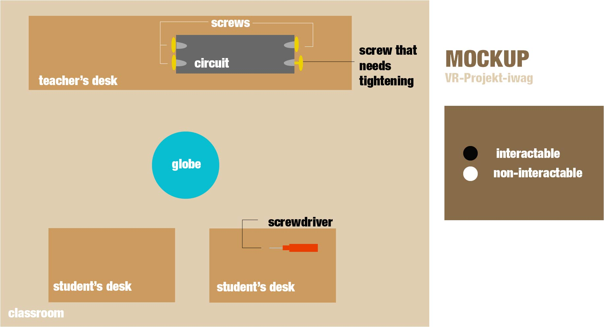

# Template Repository for Unity3D version 2019.1.14f1

### Project description: 
Das Projekt ist anhnad der Wörter "physics", "power" und "search" aufgebaut.

In der Mitte eines Physikklassenraums steht ein Globus, welcher anfangs unbeleuchtet ist. Auf dem Lehrerpult steht ein elektrischer Kreislauf, der damit verbunden ist, allerdings ist eine Schraube locker.

Die Challenge ist es, im Klassenraum einen Schraubenzieher zu finden, welcher auf einem der Schülertische platziert ist. Diesen muss man grabben und kann dann, in Form einer Drehbewegung mit dem Controller, die Schraube festziehen. Der Globus ist jetzt beleuchtet und das Spiel geschafft.

Die Fortbewegung funktioniert via Teleportation.

### Controls
- Press and hold joystick to teleport to any point on the teleport area in the room
- Look around by moving your head with the Oculus Rift headset
- Press and hold the x or a button to grab objects
- Tighten screws by executing a twist motion when in range of a screw whilst grabbing a screwdriver 

### Development platform: 
- Windows 10 64 bit, GTX 1070 MaxQ, Intel i7 Hexa-Core
- Unity3D 2019.1.14f, API Compatibility Level .NET Standart 2.0, Scripting Runtime Version .NET 4.x Equivalent
- Visual Studio COmmunity 2019 16.4.0
- Oculus Rift

### Target platform: 
- Windows 10 64 bit
- Oculus Rift

### Visuals: 
#### Mockup:

### Necessary setup/execution steps: 
Installation process, e.g. step by step instructions that I can run the project after cloning it

### Third party material:
- [Unity 3D-Template](https://github.com/5ahmnm1920-mep3-G2/unity-2019.1.14f1-3D-template)
- [VR Setup Guide](https://www.youtube.com/watch?v=5C6zr4Q5AlA)

### Project state: 
Setup phase, getting started. [2/100%]

### Limitations: 

### Lessons Learned: 

Copyright by Ida :)
